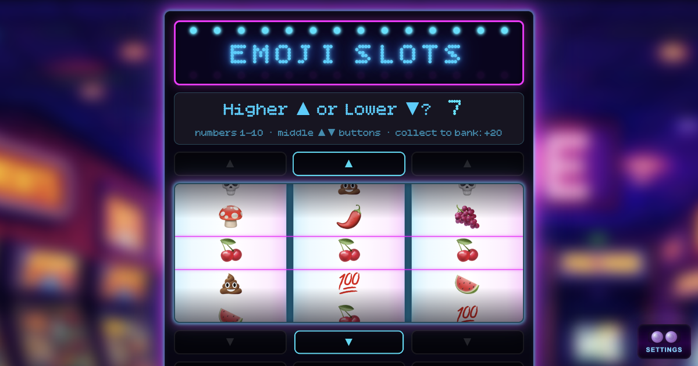

# Emoji Slots RPG

**Live:** https://emojislotsrpg.philipnewborough.co.uk/



> Step into a glowing neon arcade, circa 1988. Emoji Slots is a browser-based fruit machine with full UK pub-style mechanics: spin three emoji reels, hold wheels between spins, nudge them up or down into line, and gamble your winnings through bonus rounds — Higher/Lower, Pick a Box, and Spin the Wheel. Random arcade encounters throw RPG-style events into the mix. Match cherries, unicorns, or the elusive 💯 to fill your pockets. Hit a triple 💩 and watch your coins vanish. Hit 💀💀💀 and it's game over. Built with a synthwave CRT aesthetic, arcade sound effects, and background music. Your coins are saved — come back any time.

A browser-based fruit machine with full UK pub-style mechanics, set in a glowing synthwave arcade. Built as a vanilla JS progressive web app (PWA).

## Gameplay

- **Spin** three emoji reels — rendered on an HTML canvas — and match symbols to win coins.
- **Hold** one or more wheels between spins to keep favourable symbols in place.
- **Nudge** wheels up or down to coax a winning line into position.
- **Gamble** your winnings through three bonus rounds: Higher/Lower, Pick a Box, and Spin the Wheel.
- **RPG encounters** — one of 29 named random arcade scenarios interrupts play every three spins with story choices that can win or lose you coins, straight out of 1988.
- **Reach 1,000,000 coins** to trigger the winner screen. Hit triple 💀💀💀 and it's game over.

### Symbols and pay table

| Symbol | × 2 | × 3 |
|--------|-----|-----|
| 🍒 🍄 | +10 | +20 |
| 🥝 🍉 | +10 | +30 |
| 🍋    | +10 | +40 |
| 🍆    | +20 | +40 |
| 🌶️    | +20 | +50 |
| 🍇    | +20 | +60 |
| 💯    | +30 | +100 |
| 🦄    | +50 | +150 |
| 💩    | −20 | −100 |
| 💀    | —   | DEATH |

Matches on the left two wheels or all three unlock the bonus feature.

### Charms

RPG scenarios can award one of four persistent charms that stay attached to the machine for the rest of the session:

- **Arcade Cat** — a lucky ginger cat appears on the machine and unlocks the Cat's Walk bonus mini-game.
- **Fluffy Dice** — decorative lucky dice, a classic 1988 arcade good-luck token.
- **Troll** — a lucky troll unlocks the Troll's Gambit bonus mini-game.
- **Wizard (Zoltan)** — clicking the wizard charm opens Zoltan's Blessing modal, confirming that all slot wins are multiplied ×10 until the game is reset. The pay table updates to reflect the boosted values.

Charms are persisted in `localStorage` and restored automatically when returning to the game.

### Persistence

Coin balance and earned charms are saved to `localStorage`. Returning players see a "Welcome Back" modal with the last-saved coin total instead of the first-run intro. Volume levels (SFX and music) are also persisted independently of a game reset.

## Tech

- Vanilla JavaScript, HTML, CSS — no framework
- Emoji reels rendered on an HTML `<canvas>` element; particle explosions on a second overlay canvas
- [Howler.js](https://howlerjs.com/) for audio — SFX and two randomly selected looping background music tracks (`arcade-tide.mp3` / `pixel-tide.mp3`)
- Service Worker for offline support and PWA install; checks for updates on every visibility-change event and reloads automatically when a new SW takes control
- Custom `cache-bust.js` script to fingerprint static assets on deploy
- Custom `BitcountGridSingleInk` bitmap font for the synthwave CRT aesthetic

## Project Structure

```
public/
  index.html              # App shell and all modal markup
  manifest.json           # PWA manifest
  sw.js                   # Service worker (cache-first, auto-update)
  scenarios-rpg.json      # 29 RPG encounter definitions
  css/
    main.css              # Synthwave CRT styling
  fonts/
    BitcountGridSingleInk.css
  js/
    main.js               # All game logic
    scripts/
      arcade-cat.js       # Renders the lucky cat charm
      show-fluffy-dice.js # Renders the fluffy dice charm
      troll-charm.js      # Renders the troll charm
      show-wizard-charm.js# Renders the wizard charm and updates pay table
    vendor/
      howler.js           # Audio library
  audio/                  # SFX and background music tracks
  img/                    # Icons, OG image, and charm artwork
```

## Development

No build step required. To update asset cache-busting hashes before deploying:

```bash
node cache-bust.js
```

## Licence

See [LICENSE](LICENSE).
